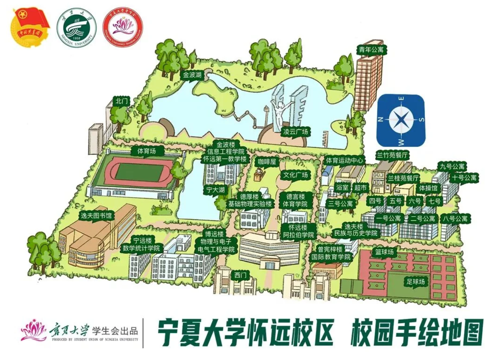
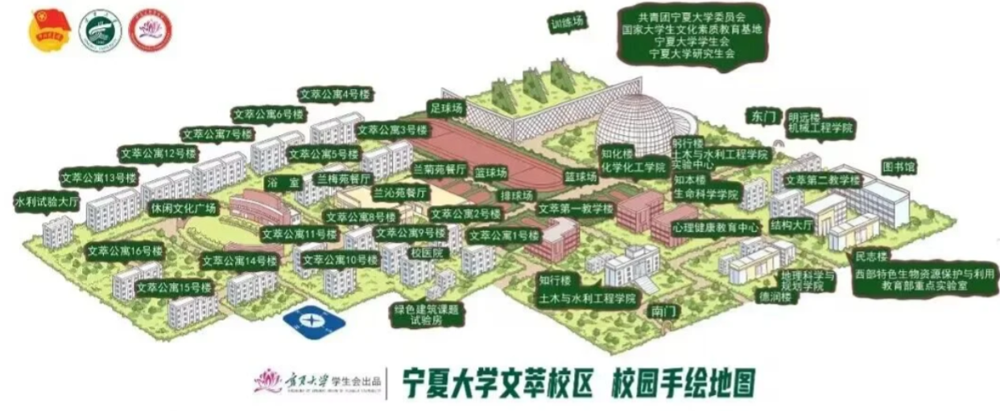
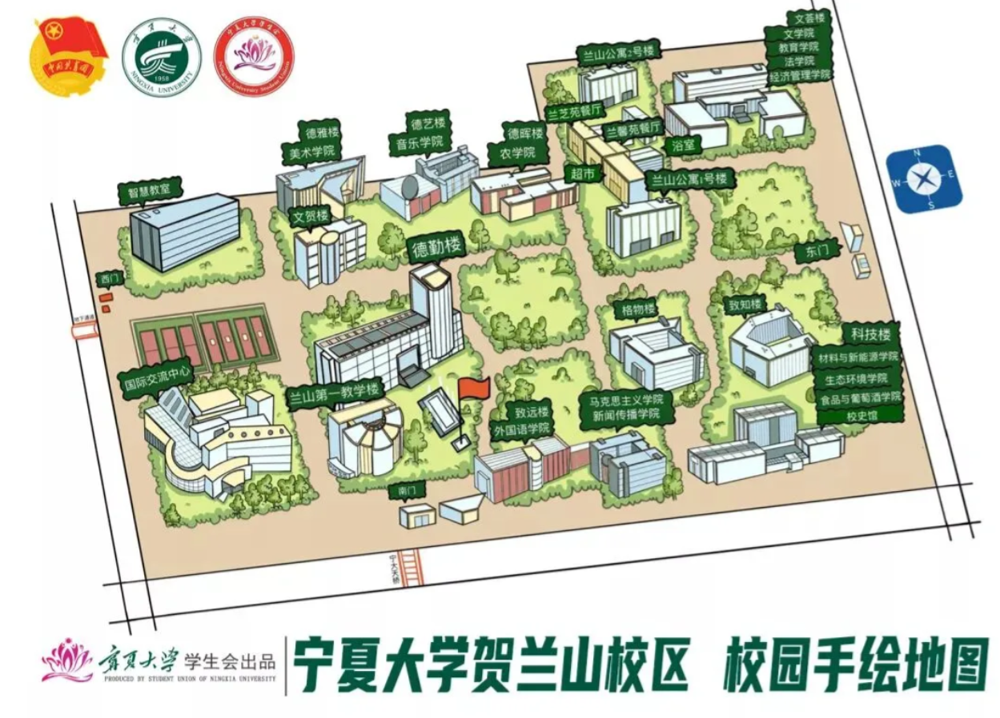
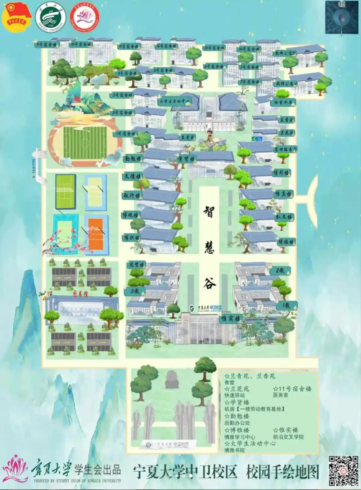

# 二、了解宁夏大学

> 参差多态，乃是幸福本源。
>
> ——伯特兰·罗素

看到这里，想必你已经结束军训了，那么接下来我们初步了解一下你接下来四年的本科院校。

## 校区

宁夏大学本部共有三大校区，分别是文萃校区、怀远校区与贺兰山校区，此外在银川市还有朔方校区、新华书院（独立学院，三本，民办性质）。

**1. 怀远校区**（原 B 区，老校区）

- **地址**：宁夏银川市西夏区文萃北街 217 号
- **入驻学院**：数学统计学院、物理与电子电气工程学院、化学化工学院、信息工程学院等
- **特点**：校舍较旧，但交通便利，环境优美，临近怀远夜市与宁阳广场，方便出去玩



**2. 文萃校区**（原 C 区）

- **地址**：宁夏银川市西夏区贺兰山西路 539 号
- **入驻学院**：人文学院、法学院、经济管理学院、新闻传播学院等人文类学院，以及美术学院、音乐学院等艺术类学院
- **特点**：校园环境优美，图书馆资源丰富，宿舍条件较好



**3. 贺兰山校区**（原 A 区）

- **地址**：宁夏银川市西夏区贺兰山西路 489 号
- **重点实验室**：包括宁夏优势特色学科的实验基地
- **入驻学院**：农学院、葡萄酒与园艺学院、动物科技学院等
- **特点**：校园面积大，绿化好，学生居住集中，有全宁大最新最好的教室（未来教室），学校大多数行政部门都集中在贺兰山主楼



**4. 朔方校区**（~~暂未收录~~）

**5. 中卫校区**（仅有地图）



**6. 金凤校区**（~~暂未收录~~）

**7. 新华书院**（~~暂未收录~~）

## 书院制度

宁夏大学行政制度经历过一次改革，现行制度为：

```plain
学校 → 书院 → 学院 → 专业 → 班级（一个专业可能只有一个班）
```

每个书院各有不同的管理风格。幸运的是，信息工程学院所属**求是书院**，有着全宁夏大学数一数二的人文关怀和善解人意的导员们。

截至 2025 年 9 月，宁夏大学各书院、学院的对应关系如下：

```plain
宁夏大学
├── 尚德书院（艺术类）
│   ├── 马克思主义学院
│   ├── 新闻传播学院
│   ├── 音乐学院
│   └── 美术学院
├── 勤学书院（人文社科类、商科类）
│   ├── 法学院
│   ├── 经济管理学院（已拆分为经济学院与管理学院）
│   └── 教师教育学院
├── 鼎新书院（传统工科类）
│   ├── 机械工程学院
│   ├── 化学化工学院
│   └── 材料与新能源学院
├── 求是书院（计算机类、电气类）  ★ 信工所在
│   ├── 数学统计学院
│   ├── 物理学院
│   ├── 电子与电气工程学院
│   ├── 信息工程学院
│   └── 人工智能学院
├── 励行书院（生命与食品类、地理与工程类）
│   ├── 生命科学学院
│   ├── 动物科技学院
│   ├── 食品科学与工程学院
│   ├── 土木与水利工程学院
│   ├── 建筑学院
│   └── 地理科学与规划学院
├── 守正书院（文科类、语言类、体育）
│   ├── 文学院
│   ├── 民族与历史学院
│   ├── 阿拉伯学院
│   ├── 外国语学院
│   ├── 国际教育学院
│   └── 体育学院
├── 博雅书院（中卫校区，暂不收录）
└── 新华书院（独立学院，暂不收录）
```

