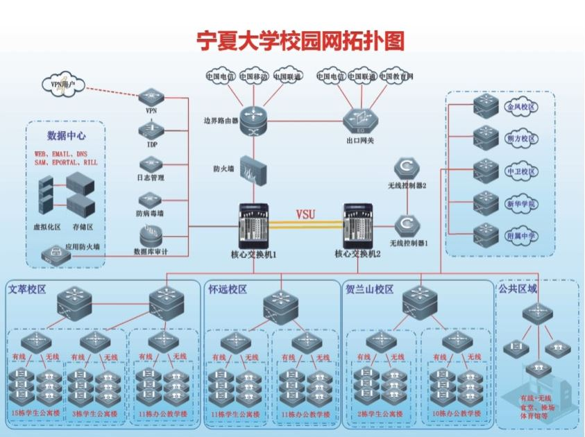

# 三、信息化服务

> 信息想要自由。
>
> ——斯图尔特·布兰德

### 校园网与 VPN 使用

首先，宁夏大学校园网拓扑结构如下：



可以看到，包括附属中学在内的所有校区的网络都属于一个局域网，但是普通用户登录进去默认是 DHCP 分配 IP 地址，所以要在内网部署服务的话，可能没有稳定的静态 IP。

学校的一系列线上资源（双创平台、教务平台、图书馆数字资源等），包括我们鑫启网安社的资源站，都可以在校园网内部直接访问。

校园网在设备初次登录、或是 IP 租约到期的时候，都需要进行认证。移动端（Android / iOS）在连接网络的时候会直接跳转到认证界面，若没跳转则需使用浏览器访问任意网址，之后会重定向到认证页面；电脑端同理，连接后访问任意网址以进入认证页面。

在某些情况下，校园网认证会被你的梯子或者浏览器的部分规则所阻断，这个时候需要手动访问以下网页进行认证：

```plain
http://10.10.10.181
```

> **注意**：宁夏大学校园网账号与统一身份认证账号（IDS）是两套系统，密码并不一定相同，这块后面会讲。

### 教务管理平台

宁夏大学教务管理平台网址为：

```plain
https://jwgl.nxu.edu.cn
```

通常来说只能从内网访问，但是部分时期（如抢课高峰期等等）可以直接从外网访问。

教务系统在抢课等高并发场景下很可能出现「超过人数上限」字样，这是因为宁夏大学校园网的负载均衡做得有问题，会把大量的请求重定向到某一到两个后端，导致了所谓「一方有难，八方围观」的情况。

在出现这种情况的时候，可以手动切换以下这些 URL 进行访问（即让闲着的后端忙起来）：

```python
urls = [
    "http://202.201.128.38:8080/login.action",
    "http://202.201.128.38:8081/login.action",
    "http://202.201.128.38:8082/login.action",
    "http://202.201.128.38:8083/login.action",
    "http://202.201.128.39:8080/login.action",
    "http://202.201.128.39:8081/login.action",
    "http://202.201.128.39:8082/login.action",
    "http://202.201.128.39:8083/login.action",
    "http://202.201.128.234:8080/login.action",
    "http://202.201.128.234:8081/login.action",
    "http://202.201.128.234:8082/login.action",
    "http://202.201.128.234:8083/login.action",
    "http://202.201.128.235:8080/login.action",
    "http://202.201.128.235:8081/login.action",
    "http://202.201.128.235:8082/login.action",
    "http://202.201.128.235:8083/login.action",
]
```

教务管理平台主要功能为：分数查询、课程表查询和选课等。

### 常用 APP / 公众号

> 待补充

### 网络访问补充说明

校园网出口部署了流量检测设备（DPI），会对部分协议和境外 IP 进行干扰或阻断，导致 GitHub、Google 学术、Stack Overflow 等开发常用站点偶尔无法访问。

#### 科学上网的本质

所谓「翻墙」，本质上是将流量伪装成正常流量以绕过 DPI 检测。核心思路不是「找一个能用的软件」，而是理解不同协议被识别的难易程度。

#### 常见协议与风险

| 协议/方案 | 伪装能力 | 说明 |
|-----------|----------|------|
| VMess / VLESS + WebSocket + TLS | ★★★★★ | 流量外观与普通 HTTPS 网站无异，配合 CDN（如 Cloudflare）使用更隐蔽 |
| Trojan / Trojan-Go | ★★★★☆ | 直接伪装为 HTTPS，握手阶段比 VMess 更「干净」，不易被主动探测识别 |
| Shadowsocks + 混淆插件 | ★★★☆☆ | 2022 新版 AEAD 加密 + v2ray-plugin 等插件可提升隐蔽性，但独立使用时特征相对明显 |
| Hysteria / Hysteria2 | ★★★★☆ | 基于 QUIC 协议（HTTP/3），天然抗丢包，伪装为正常 QUIC 流量 |
| WireGuard / OpenVPN | ★☆☆☆☆ | 协议指纹非常明显，校园网基本秒封，不建议使用 |
| ShadowsocksR（SSR） | ★☆☆☆☆ | 已停更多年，特征库完善，极易被识别 |

#### 客户端与协议的区别

这里需要澄清一个常见的误区：**Clash、v2rayN、Sing-box、Shadowrocket 等是客户端（图形界面），不是协议。** 它们本身不决定安全性——安全性取决于你在客户端中配置的协议（VMess、Trojan 等）。说「某客户端能不能用」是没有意义的，真正重要的是你跑的是什么协议、节点如何配置。

#### 实用建议

1. **优先使用支持 TLS 的协议**：VMess + WebSocket + TLS 或 Trojan 是目前最稳妥的方案，流量看起来就像在访问一个普通的 HTTPS 网站。
2. **套一层 CDN**：节点前挂 Cloudflare 等 CDN，既能隐藏真实服务器 IP，又能借助 CDN 的泛域名证书让 TLS 握手更「正常」。
3. **避免使用境外商业 VPN**：大多数商业 VPN 的协议特征已被录入校园网设备特征库，建议自行搭建（VPS 成本目前已很低）。
4. **具备基本的信息素养**：没有百分百能用的方案，本文所述的任何技术都可能随时失效——计算机专业的学生应当具备自行检索、调试和更换方案的能力。
5. **注意合规使用**：以上内容仅供学习交流网络协议原理。请在遵守法律法规的前提下使用网络。

