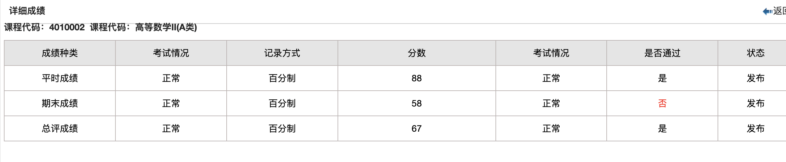

# 五、学习

> 万物皆有裂痕，那是光照进来的地方。
>
> ——莱昂纳德·科恩

### 学习技巧

绩点在任何时候都非常重要，即使有人可能已经有了自己清晰的规划与想法，此处仍然强烈建议花费精力维持你的绩点，不要挂科。

对于信息工程学院的同学而言，各类课程的重要性排名如下：

```plain
水课 << 数理基础 == 英语 <= 专业课
```

是的，英语和数理基础（高数上下、线代、概率论、离散数学）在计算机学习过程中有着不可忽视的权重：英语的学习决定了你能够获取知识的渠道，而数理基础的学习决定了你未来计算机技术的上限。

由于学校教学的规章制度与学生以就业为导向的成长计划之间不可调和的矛盾，即使是水课，也**不建议**频繁翘课。此处作者认为折中的方法是在课上做真正能够提升自己的事情：如果老师宽松，可以在课上使用笔记本电脑提前学习一些技术；即使老师比较严苛，课上也基本不会管你学数学写作业之类的。

以下分享一些课程的学习技巧：

#### 有期末考的水课

包括思想道德与法治、军事理论、形势与政策、中国近现代史纲要、马克思主义基本原理等等。

考勤、平时表现等依老师而定。期末成绩这块，在「宁大小助手」公众号中可以找到对应题库，刷一刷基本上可以及格。

#### 没有期末考的水课

包括劳动教育实践、大学生心理健康教育等等。

通常来讲这类课由各个书院的导员进行兼职。期末作业尽量使用 AI 提升效率，但是一定要进行复核，不要有过于明显的痕迹。

有些可能要求手写，可以在闲鱼上找代抄。

#### 英语

值得注意的是，宁夏大学有**英语免修机制**，所以一定要争取在大一上过四级、大一下过六级，这样大二就能少上一年的英语课，节省出 72 个小时的时间做更有意义的事情。

- **A 班**：如果你高考英语分数超过 118（此分数可能有所变动），会被分配到 A 班，在大一的学年初和学年末分别进行选课（抢课很激烈，要上心）。每个老师的风格不同，教学内容也不同。作者这里只上过吴学茵老师和王晶老师的课，就作者的经历而言，非常推荐选这两位老师的课，都是专业基础过硬、认真负责且好拿分。
- **B 班**：（没上过，暂无描述）

#### 专业课

> 待补充

### 分数核算制度

宁夏大学分数核算制度为：

```plain
总评成绩 = 平时成绩 × 平时成绩权重 + 期末成绩 × 期末成绩权重
```

一门科目，只要你的总评成绩过了 60 分就算通过。

以作者大一下的高数成绩为例：



虽然期末成绩考得很差，但是总评成绩依然超过 60 分，所以并不算挂科，无需重修。

### 挂科与重修

> 待补充

### 免试攻读研究生政策（保研）

> 待补充

### 国外硕士申请

> 待补充

### 图书馆的使用

> 待补充

